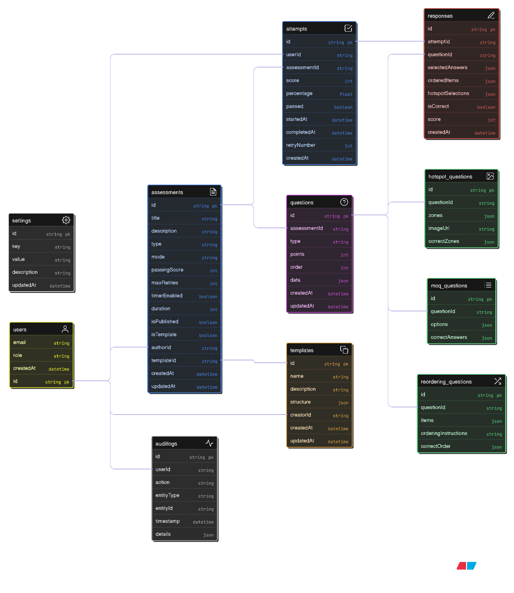

# Evalu8 — Assessment Authoring Tool (Demo)

Demo-ready **Assessment Authoring Tool** built for an Assessments Engine. It showcases the end-to-end instructor flow for creating an assessment with multiple polymorphic question types, assisted by a simulated GenAI workflow.

The primary goal of this project is to demonstrate:

- **User flow** for authoring different question types and switching between them.
- **Purpose-driven metadata** and conditional validation for formative vs summative assessments.
- **Robust data architecture** for storing polymorphic questions in a single schema.
- **AI-assisted creation** with a “human-in-the-loop” review workflow.

## Core Features (as per assignment)

### 1) Multi-Type Authoring Flow
You can author and switch between:

- **MCQ**
  - Stem + options (distractors)
  - Correct answer(s)
  - Optional explanation
  - (Formative) option-specific feedback
- **Ordering**
  - A list of items
  - UI supports reordering logic
  - Correct order is persisted
- **Hotspot (Mock)**
  - Define “correct” coordinate zones on an image
  - Zones are persisted as coordinate arrays

### 2) Purpose-Driven Logic & Metadata

- **Formative Mode**
  - Mandates **option-specific feedback** for every distractor (MCQ).
  - Enables more practice/feedback-oriented settings.
- **Summative Mode**
  - Mandates **Learning Objective** and **Bloom’s Level**.

The UI provides real-time validation feedback based on these toggles.

### 3) GenAI Assistance Flow (Simulated “AI Suggest”)

The author can enter a topic (example: "Linear Programming") and click **AI Generate**, which populates:

- Suggested question stem
- Suggested distractors
- Suggested metadata (difficulty/Bloom’s, etc.)

The author remains in control: AI output is treated as a draft to be reviewed and edited.

---

## Tech Stack

- **Language**
  - TypeScript
- **Frontend framework**
  - Next.js (App Router)
- **Backend**
  - Next.js App Router route handlers (`app/api/*`)
- **State management**
  - Zustand (project dependency) + a lightweight client-side store for nested authoring state
- **ORM**
  - Prisma
- **Database**
  - MongoDB
- **UI**
  - TailwindCSS + Radix UI primitives + Framer Motion

---

## Local Setup

### Prerequisites

- Node.js (recommended: current LTS)
- A MongoDB instance (local or MongoDB Atlas)

### 1) Install dependencies

```bash
npm install
```

### 2) Configure environment variables

Create a `.env.local` file in the project root.

Required:

- `MONGODB_CONNECTION_STRING`
  - MongoDB connection string used by Prisma (`provider = "mongodb"`).
- `MISTRAL_API_KEY`
  - API key used for the AI helper flow.

Example:

```bash
MONGODB_CONNECTION_STRING="mongodb+srv://<user>:<pass>@<cluster>/<db>?retryWrites=true&w=majority"
MISTRAL_API_KEY="your_mistral_api_key_here"
```

### 3) Generate Prisma client

```bash
npx prisma generate
```

### 4) Push schema to MongoDB

```bash
npx prisma db push
```

### 5) Run the app

```bash
npm run dev
```

Open:

- `http://localhost:3000`

---

## Demo Flow (Instructor / Author Journey)

1. Open the **Create Assessment** screen.
2. Fill assessment-level metadata (title, subject, duration, mode).
3. Switch between authoring tabs:
   - Setup
   - Editor (question builder)
   - AI (assistive generation)
4. Add questions of different types (MCQ, Ordering, Hotspot).
5. Use **Save Draft** to persist the assessment with `status="draft"`.
6. Use **Publish** to persist the assessment with `status="published"`.

Editing an existing assessment is supported via query params:

- `/create-assessment?edit=<assessmentId>`

---

## Database & Data Architecture

### Why this structure?

Assessments contain many questions, and each question type has:

- **Shared fields** (type, stem, order, difficulty, Bloom’s, etc.)
- **Type-specific fields**
  - MCQ: `options[]`, `correctAnswers[]`, `distractorFeedback`
  - Ordering: `items`, `correctOrder[]`
  - Hotspot: `zones`, `imageUrl`, `hotspotInstructions`

To keep querying simple while remaining flexible, the schema uses:

- A single `Question` model with **optional fields** for type-specific data.
- JSON fields (`items`, `zones`, `distractorFeedback`) for complex nested payloads.
- An `Assessment` model that stores configuration, status, and mode-level metadata.

This approach is easy to extend to new question types without requiring a disruptive migration.

### Schema diagram



### Prisma schema

The authoritative schema is in:

- `prisma/schema.prisma`

Key collections/models:

- `User`
- `Assessment`
- `Question`
- `Attempt`, `Response` (for future assessment execution)
- `AuditLog` (supports future versioning / tracking)

---

## GenAI Strategy (Human-in-the-loop)

This project demonstrates a *safe* authoring workflow where AI suggestions are helpful but not authoritative.

If connected to a real LLM in production, the recommended strategy is:

- **Draft-first generation**
  - AI output is always stored as a draft and never published automatically.
- **Structured outputs**
  - Enforce strict schemas (e.g., Zod) for MCQ options, correct answers, and metadata.
- **Review + edit UI**
  - Authors can accept, edit, or discard AI suggestions.
- **Provenance tracking**
  - Persist AI prompt + response + model metadata per question revision.
- **Guardrails**
  - Run validations (duplicate options, missing feedback in formative mode, etc.) before allowing save/publish.

---

## Conditional Validation Rules

The authoring UI enforces different requirements based on assessment intent:

- **Formative**
  - Requires **option-specific feedback** per distractor for MCQs.
- **Summative**
  - Requires **Learning Objective**
  - Requires **Bloom’s Level**

This prevents creating assessments that are structurally valid but pedagogically incomplete.

---

## Future-Proofing (Version Control for Questions)

To support version control similar to enterprise assessment engines, you can extend the schema with one of these patterns:

### Option A: Append-only Question Revisions (recommended)

- Introduce `QuestionRevision` as an append-only model:
  - `questionId`, `revisionNumber`, `contentSnapshot (Json)`, `createdBy`, `createdAt`, `reason`
- `Question` becomes the “pointer” to the latest revision.

Pros:

- Full audit history
- Easy rollback
- Works well with human + AI co-authoring

### Option B: Assessment Snapshots

- Store snapshots of the full assessment (`AssessmentRevision`) whenever published.
- Keep drafts mutable; published versions immutable.

### Audit Logs

The existing `AuditLog` model can be used to track create/update/publish actions, including the diff payload.

---

## Scripts

- `npm run dev` — run locally
- `npm run build` — `prisma generate && next build`
- `npm run start` — start production server

